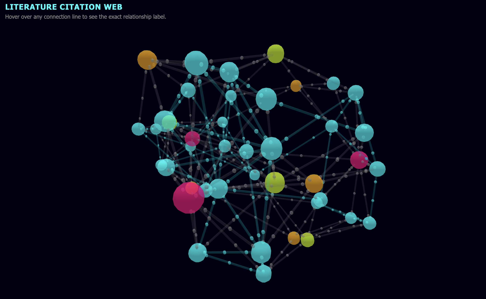

# Lab Report: 3D Academic Literature Semantic Network & Recommender

## Title
Construction and Visualization of a 3D Semantic Network for Academic Literature, with Paper Recommendation Systems

## Objective
- To model a heterogeneous semantic network of research papers, domains, methodologies, and authors as nodes connected by labeled edges.
- To programmatically generate the graph (nodes and links) as JSON using Python.
- To visualize the network as an interactive 3D force-directed graph using `3d-force-graph`, with click-to-highlight node exploration.
  To implement a paper recommendation system based on **title, author, and methodology**, including:
  - an offline Jaccard-similarity recommender that finds the top-3 similar papers for each paper, with explanations.
  - an interactive HTML page where a user optionally selects a domain, methodology, and/or author to get the top-5 matching papers.

## Theory

**Semantic networks** represent knowledge as a graph: **nodes** are concepts/entities (papers, authors, methodologies, domains) and **edges** are labeled relationships between them, following the **knowledge triple** structure `Subject --> Predicate --> Object` (e.g., `Paper --AUTHORED_BY--> Author`).

This network is **heterogeneous**, with four node types:

| Node type | Represents | Example |
|---|---|---|
| Domain | Academic field | Computer Vision, NLP, Geometric Deep Learning |
| Methodology | Algorithmic approach | Transformers, CNNs, GNNs, Contrastive Learning |
| Author | Principal investigator | Dr_A_Vaswani, Dr_Y_Bengio |
| Paper | Publication | "BERT-Large: Pre-training of Deep Bidirectional Transformers" |

A **force-directed layout** simulates repelling nodes and spring-like edges, so connected nodes (e.g., papers sharing a domain) cluster naturally without manual positioning.

**Recommendation via Jaccard similarity**: for two papers A and B,
```
Jaccard(A, B) = |Features(A) ∩ Features(B)| / |Features(A) ∪ Features(B)|
```
Each paper's feature set combines title keywords, its author, and its methodology. Papers with the highest overlap are recommended, with the shared features used as a human-readable explanation.

## Source Code

### 1. Network Generation (`generate_network.py`)
Builds 30 papers across 3 domains and 4 methodologies. For each paper, three edges are added:
```python
edges_set.add((title, dom_name, "BELONGS_TO"))
edges_set.add((title, meth_name, "UTILIZED"))
edges_set.add((author, title, "AUTHORED"))
```
Citation (`CITES`) edges are added for papers from index 5 onward, mostly within the same domain with occasional cross-domain citations. The result is exported to `network_data.json` as `{"nodes": [...], "links": [...]}`.

### 2. 3D Visualization (`network.html`)
Uses `3d-force-graph`, coloring nodes by type and sizing Domain/Methodology nodes larger as hubs:
```javascript
const Graph = ForceGraph3D()(document.getElementById('3d-graph'))
    .jsonUrl('network_data.json')
    .nodeColor(node => colorPalette[node.group] || '#ffffff')
    .nodeVal(node => node.group === 'Domain' ? 8 : node.group === 'Methodology' ? 6 : 3.5)
    .linkColor(link => link.label === 'CITES' ? '#00ffff' : '#88888b')
    .linkDirectionalParticles(3);
```
`onNodeClick` zooms the camera to the selected node, highlights its direct neighbors and links, and shows a metadata card (group, category, recommendation text). `onBackgroundClick` resets the view.

### 3. Offline Recommender (`recommend_papers.py`)
Builds a feature set per paper (title tokens + `author::X` + `methodology::Y`), then computes Jaccard similarity against every other paper:
```python
def jaccard_similarity(set_a, set_b):
    return len(set_a & set_b) / len(set_a | set_b) if (set_a | set_b) else 0.0

scores.sort(key=lambda x: (-x[1], x[0]))
top_matches = scores[:3]
```
For each top match, `explain_overlap()` reports whether the match shares an author, methodology, and/or title concepts. Output is saved to `paper_recommendations.json`.

### 4. Interactive Recommender (`paper_recommender.html`)
Fetches `network_data.json` directly and rebuilds each paper's domain/methodology/author from its edges:
```javascript
data.links.forEach(link => {
    if (link.label === 'BELONGS_TO') domainOf[link.source] = link.target;
    else if (link.label === 'UTILIZED') methodOf[link.source] = link.target;
    else if (link.label === 'AUTHORED') authorOf[link.target] = link.source;
});
```
Each paper scores 0–3 based on how many selected filters (domain, methodology, author — all optional) it matches:
```javascript
results = scored.filter(r => r.score > 0)
    .sort((a, b) => b.score - a.score || a.paper.title.localeCompare(b.paper.title));
renderResults(results.slice(0, 5), anyFilterSet, results.length);
```
If no filters are selected, all papers are listed alphabetically. The UI is a minimalist white/neutral page with three dropdowns, a "Recommend papers" button, and ranked result cards with highlighted matching tags.

## Output

**3D network (`network.html`)**: a dark-themed, interactive 3D graph. Domain nodes (pink) and Methodology nodes (lime) act as large hubs; Papers (cyan) and Authors (orange) cluster around them. `CITES` edges animate in cyan. Clicking a paper zooms in, dims unrelated nodes, highlights its domain/methodology/author/citations, and shows a metadata card.



*Figure 1: 3D force-directed network with a selected node and its highlighted connections.*

**Offline recommender**: sample output from `paper_recommendations.json`:
```
Paper: SimCLR-V3: Contrastive Frameworks for Self-Supervised Vision
  -> Self-Supervised Graph Contrastive Learning via Subgraph Masking (similarity: 0.308)
     [same methodology (Contrastive Learning); shared title concepts (contrastive, self, supervised)]
  -> Unsupervised Visual Representation via Contrastive Residuals (similarity: 0.25)
     [same author (Dr_G_Hinton); same methodology (Contrastive Learning); shared title concepts (contrastive)]
  -> Contrastive Node Clustering via Graph Diffusion Wavelets (similarity: 0.231)
     [same author (Dr_G_Hinton); same methodology (Contrastive Learning); shared title concepts (contrastive)]
```

**Interactive recommender (`paper_recommender.html`)**: with no filters, all 30 papers are listed alphabetically. Selecting, e.g., Methodology = Contrastive Learning narrows results to the top 5 papers using that methodology, with the matching tag highlighted. Combining filters (e.g., Domain = Geometric Deep Learning + Author = Dr_J_Leskovec) ranks 2/3-matches above 1/3-matches, up to 5 results.


*Figure 2: Interactive recommender with optional Domain/Methodology/Author filters and top-5 ranked results.*

## Discussion and Key Points

1. **Heterogeneity adds interpretability**: four distinct node types (Domain, Methodology, Author, Paper) capture multiple dimensions of academic structure in one graph.
2. **Hub formation emerges naturally**: every paper links to one Domain and one Methodology, so these become high-degree hubs that the force-directed layout clusters papers around automatically.
3. **Citation edges model realistic specialization**: most citations stay within-domain, with occasional cross-domain links simulating interdisciplinary influence.
4. **Interactivity aids exploration**: click-to-highlight and camera focus let a user isolate a paper's full neighborhood, which a static graph cannot do at scale.
5. **Both recommenders validate the feature design**: papers sharing methodology/author consistently rank highest in the offline Jaccard recommender (e.g., 0.308 for two contrastive-learning papers), and the interactive recommender's edge-derived filters return sensible top-5 lists, staying in sync with the generated graph automatically.
6. **Limitations**: citations are randomly generated rather than real bibliographic data; the `rec` text in the 3D viewer's metadata card is templated, separate from the computed recommendations; both recommenders weight all features equally and ignore citation-graph proximity as a similarity signal.

## Conclusion
In this lab, we built a heterogeneous semantic network of papers, domains, methodologies, and authors, exported it as JSON, and visualized it as an interactive 3D force-directed graph. On top of this graph, two complementary recommenders were implemented: an offline Jaccard-similarity recommender producing explainable top-3 "similar papers," and an interactive web page returning the top-5 papers matching optional domain/methodology/author filters derived live from the graph data. Together these demonstrate core semantic network concepts — nodes, edges, knowledge triples, and graph-based recommendation — and their application to literature mapping.